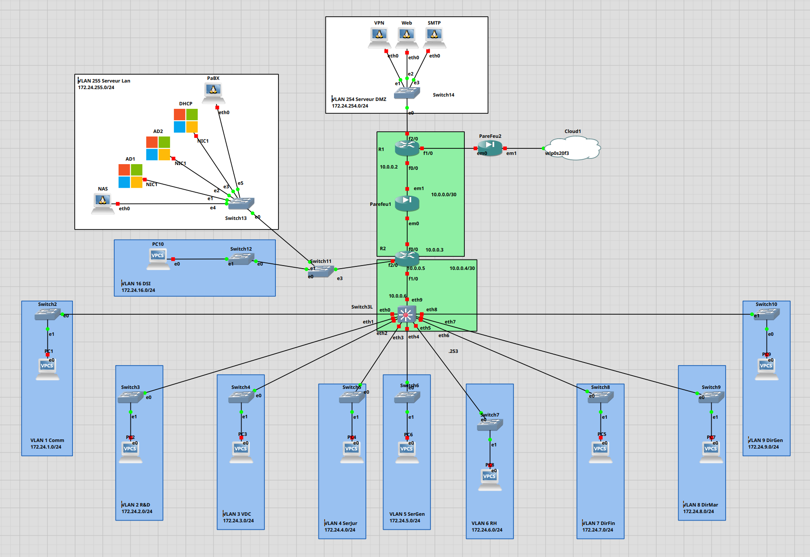

# Table de routage - Ekoloclast

## Pour le Routeur 1 
| Adresse Réseau | Masque | Passerelle | Interface |
|:---:|:---:|:---:|:---:|
| 172.24.254.0 | 255.255.255.0 | direct | 172.24.254.253 |
| 172.24.255.0 | 255.255.255.0 | 10.0.0.3 | 10.0.0.2 |
| 172.24.0.0 | 255.255.224.0 | 10.0.0.3 | 10.0.0.2 |
| 0.0.0.0 | 0.0.0.0 | direct | f1/0 | 

## Pour le Routeur 2
| Adresse Réseau | Masque | Passerelle | Interface |
|:---:|:---:|:---:|:---:|
| 172.24.255.0 | 255.255.255.0 | direct | f2/0:172.24.255.253 |
| 172.24.16.0 | 255.255.255.0 | direct | f2/0:172.24.16.253 |
| 172.24.0.0 | 255.255.240.0 | 10.0.0.6 | 10.0.0.5 |
| 0.0.0.0 | 0.0.0.0 | 10.0.0.2 | 10.0.0.3 | 

## Pour le Routeur 3L
| Adresse Réseau | Masque | Passerelle | Interface |
|:---:|:---:|:---:|:---:|
| 172.24.1.0 | 255.255.255.0 | direct | 172.24.1.253 |
| 172.24.2.0 | 255.255.255.0 | direct | 172.24.2.253 |
| 172.24.3.0 | 255.255.255.0 | direct | 172.24.3.253 |
| 172.24.4.0 | 255.255.255.0 | direct | 172.24.4.253 |
| 172.24.5.0 | 255.255.255.0 | direct | 172.24.5.253 |
| 172.24.6.0 | 255.255.255.0 | direct | 172.24.6.253 |
| 172.24.7.0 | 255.255.255.0 | direct | 172.24.7.253 |
| 172.24.8.0 | 255.255.255.0 | direct | 172.24.8.253 |
| 172.24.9.0 | 255.255.255.0 | direct | 172.24.9.253 |
| 0.0.0.0 | 0.0.0.0 | 10.0.0.5 | 10.0.0.6 | 

En se basant sur le schéma de réseau : 

